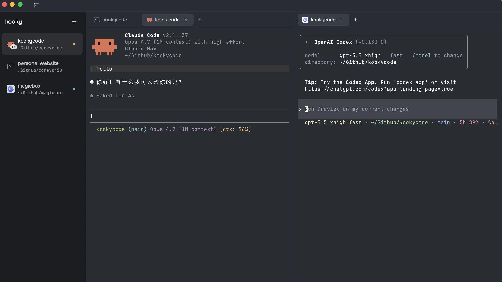

# kooky

> *专为 coding 体验优化的 macOS 终端。*

🇨🇳 中文  ·  🇬🇧 [English](README.md)



现有终端都是在 AI agent 进入开发流程之前设计的。**kooky 把 agent 会话当作第一公民 tab** —— Claude Code / Codex / Gemini CLI 跟你的 shell 平等共存,chrome 实时反映每个 agent 在做什么。开源、仅 macOS、MIT。GPU 渲染基于 [libghostty](https://github.com/ghostty-org/ghostty)。

**[下载最新版](https://github.com/iAmCorey/kooky/releases/latest)**  ·  [架构文档](ARCHITECTURE.md)  ·  [更新日志](CHANGELOG.md)

---

## 它做什么

**vertical tabs,认真做的那种。** Sidebar 列出 workspace,三态折叠(`⌘⌃S` 切换)。每个 pane 自带 tab 栏, 风格。tab 拖动重排,跨 pane 拖动整体迁移会话。状态跨重启持久化。

**一键起 AI agent 会话。** Claude Code · Codex · Gemini CLI · OpenCode · Amp。从 `+` 菜单选一个 —— shell 还没把 prompt 打出来,agent 就已经启动好了。sidebar 圆点实时显示每个 agent 此刻在跑、等你回复、还是闲着。

**知道你的 shell 干了啥。** OSC 133 / FinalTerm hooks 装在 ZDOTDIR wrapper 里,**不污染**你的 `~/.zshrc`。上一条命令失败时,tab + workspace 行出小红点;hover 看 `exit N · 12.4s`。`⌘↑` / `⌘↓` 在 scrollback 里跳上/下个 prompt。

**全键盘操作。** `⌘T` / `⌘N` 新 tab / workspace · `⌘W` / `⌘⇧W` 关闭 · `⌘1-9` / `⌥⌘1-9` 切换 · `⌘D` / `⌘⇧D` 向右 / 向下分屏 · `⌘[` `⌘]` 焦点切换 · `⌘=` / `⌘-` / `⌘0` 字号 · `⌘K` 清屏。

**真正的 macOS 外观。** Onest + JetBrains Mono 字体。32pt 顶部条带 traffic light + 显式 window drag handle(解决 title-bar 拖窗 vs tab DnD 抢手势的老毛病)。自定义 About 面板、原生菜单带快捷键提示、中日韩 / 越南文等 IME 支持。状态全部存在 `~/Library/Application Support/kooky/`,无云端、无遥测、无账号。

## 安装

从 [Releases](https://github.com/iAmCorey/kooky/releases) 下载最新的 `.dmg`,打开后把 `Kooky.app` 拖到 `Applications`。

**首次启动会被 Gatekeeper 拦下**,因为目前是 adhoc 签名(还没付费的 Apple Developer ID —— 等项目有真实用户后再上正式签名 + notarization)。会看到 *"Kooky cannot be opened because Apple cannot check it for malicious software"* 或 *"is damaged and cannot be opened"*。下面三条任选一条就能跑起来:

<details>
<summary><b>方法 A —— System Settings <i>(推荐)</i></b></summary>

1. 双击 `Kooky.app`,macOS 弹警告框。**关掉它**。
2. 打开 **System Settings → Privacy & Security**(系统设置 → 隐私与安全性),滚到 **Security** 节。
3. 在 *"Kooky was blocked to protect your Mac"* 后面点 **Open Anyway**,输密码。
4. 再次双击 `Kooky.app` → 弹框出现 **Open** 按钮 → 点。完事。
</details>

<details>
<summary><b>方法 B —— Terminal 一行命令</b></summary>

```sh
xattr -d com.apple.quarantine /Applications/Kooky.app
```
</details>

<details>
<summary><b>方法 C —— 连 "Open Anyway" 按钮都没出来时</b></summary>

Sequoia 有时对 adhoc 签名 app 干脆**不显示** "Open Anyway" 按钮。这时先重新启用旧版 "Anywhere" 选项,再走方法 A:

```sh
sudo spctl --global-disable      # macOS 15+;老系统用 --master-disable
# 打开 System Settings → Privacy & Security → "Allow applications from" 选 Anywhere
# 打开 Kooky.app → 这下就跑起来了
sudo spctl --global-enable       # kooky 跑过一次后,把 Gatekeeper 重新打开
```

注意这条**是系统级开关** —— 关掉期间 macOS 会让任何未签名 app 都能跑。kooky 跑过一次后立刻打回 enable(per-app 白名单会保留)。
</details>

macOS **只拦第一次启动**。之后 Spotlight / Dock / Finder 一切如常。

## 从源码构建

需要 Xcode 26+ 和 macOS 14+(Sonoma —— `@Observable` 是地板线)。

```sh
./scripts/setup-libghostty.sh        # 一次性:把预编译的 libghostty xcframework 下到 Vendor/
swift build
swift run                            # dev 模式直接跑
swift test                           # 31 个单测

./scripts/build-app.sh               # 产出 dist/Kooky.app
./scripts/build-dmg.sh --build       # 产出 dist/Kooky-vX.Y.Z.dmg
```

`Vendor/` 和 `dist/` 都已加进 `.gitignore`。libghostty setup 脚本是幂等的。

## License

MIT —— 见 [LICENSE](LICENSE)。打包进来的第三方资源各自保留上游 license,详见 [NOTICE.md](NOTICE.md)。
